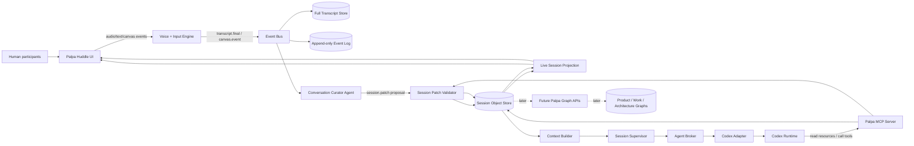
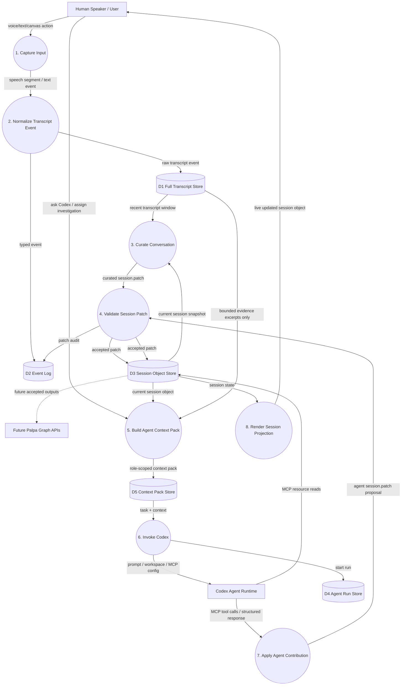
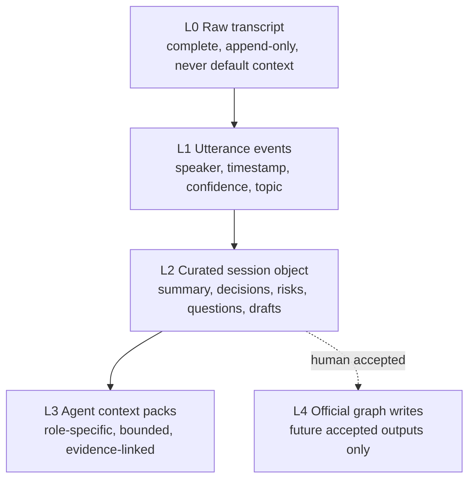
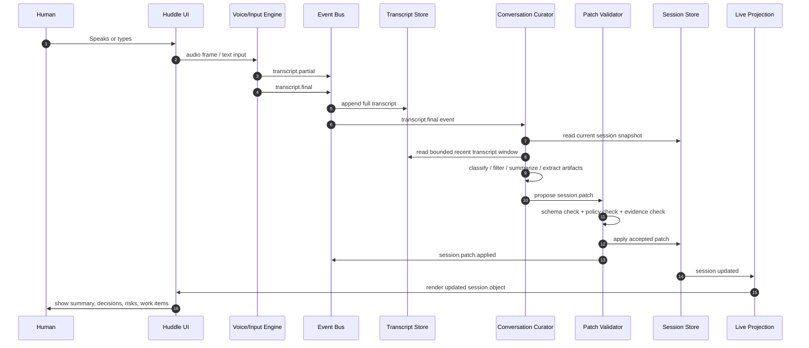
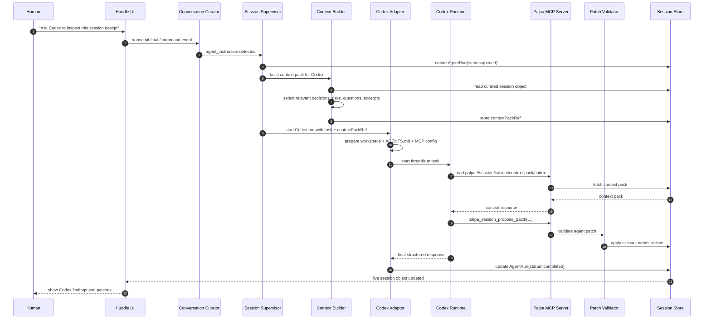
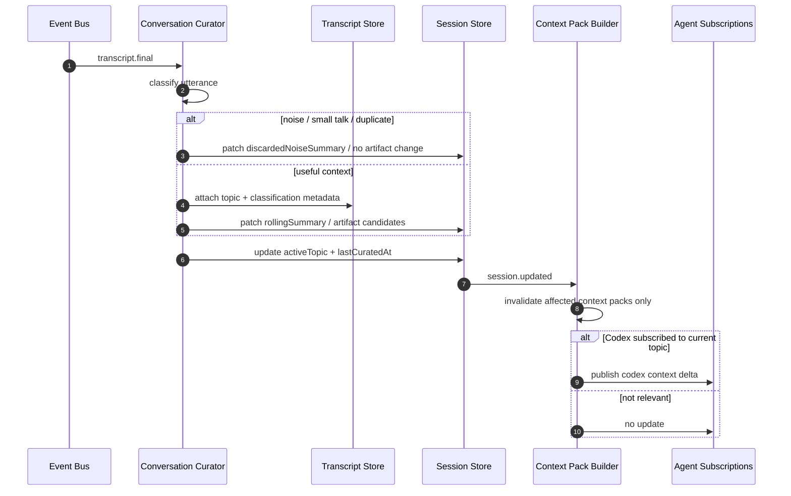
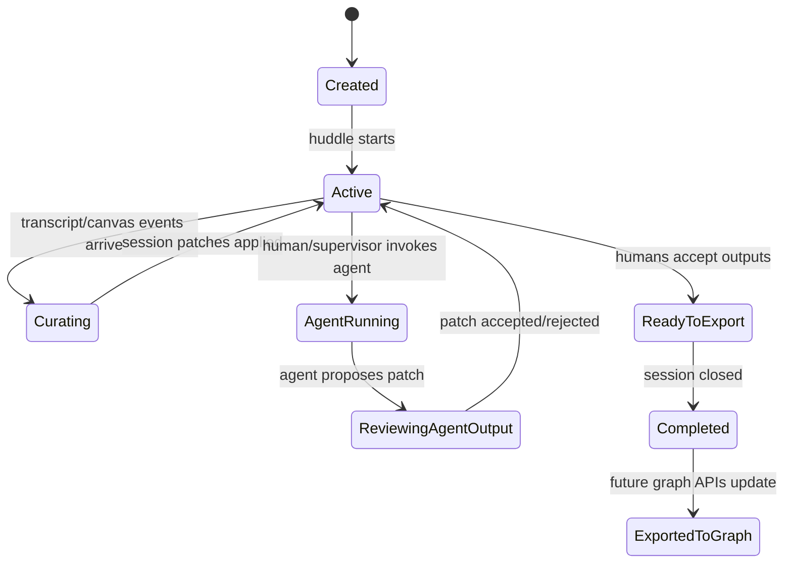

I agree. This POC should not be “voice demo + agent demo.” It should validate the **central Palpa loop**:

> **Conversation becomes a curated session object.
> The session object becomes scoped context for agents.
> Agents modify the session through controlled tools.
> Humans see, edit, accept, or reject the evolving artifact.**

That is the heart of Palpa. Everything else — graphs, C4, work graph, PM, execution, incidents — can sit behind this loop later. This directly extends the Palpa thesis of a human-governed agentic SDLC control plane and the Agent Pack idea where Palpa owns the agent contract while Codex/Claude/future runtimes are governed adapters.  

The strongest design principle here:

> **The raw transcript is evidence. The session object is the working memory. The curated context pack is what agents receive.**

Raw transcript should never become the agent’s memory by default.

---

# 1. POC objective

The POC should validate five things:

```text
1. A live huddle can produce a durable session object.
2. The complete transcript is recorded but does not pollute agent context.
3. A curator/filter/summarizer agent continuously updates the session object.
4. Codex can be invoked from Palpa with a scoped context pack.
5. Codex output can be piped back into Palpa by updating the session object through MCP/tools.
```

The POC does **not** need to prove the whole graph backend yet. The session object becomes the temporary graph.

Later:

```text
Session object patch
  → graph API call
  → work graph update
  → C4 graph update
  → decision graph update
  → runtime graph update
```

For now:

```text
Conversation
  → session object
  → Codex run
  → session object patch
  → UI display
```

That is enough to prove the interaction model.

---

# 2. The core architectural move

Create a **Session Runtime**.

The session runtime owns:

```text
complete transcript
curated summary
current topic
decisions
open questions
risks
draft artifacts
agent runs
session patches
audit log
context packs
```

It should be treated as a living object:

```ts
type PalpaSession = {
  id: string;
  title: string;
  mode: "planning" | "architecture" | "implementation-prep" | "incident";
  status: "active" | "paused" | "completed";

  participants: {
    humans: HumanParticipant[];
    agents: AgentParticipant[];
  };

  transcript: {
    fullTranscriptRef: string;
    latestUtteranceIds: string[];
    lastCuratedAt?: string;
  };

  conversationState: {
    activeTopic?: string;
    rollingSummary: string;
    usefulContextSummary: string;
    discardedNoiseSummary?: string;
    unresolvedAmbiguities: string[];
  };

  outputs: {
    productBrief?: ProductBriefDraft;
    requirements: RequirementDraft[];
    decisions: DecisionCandidate[];
    risks: RiskCard[];
    openQuestions: OpenQuestion[];
    workItems: WorkItemDraft[];
    architectureNotes: ArchitectureNote[];
    codexFindings: AgentFinding[];
  };

  agentRuns: AgentRunSummary[];

  contextPacks: {
    supervisor?: ContextPackRef;
    codex?: ContextPackRef;
    architectureReviewer?: ContextPackRef;
    pmAgent?: ContextPackRef;
  };

  audit: {
    eventLogRef: string;
    patchLogRef: string;
  };
};
```

The **complete transcript** exists, but the agent-facing state is this:

```text
rollingSummary
activeTopic
decisions
openQuestions
risks
workItems
evidenceRefs
current user request
role-specific context pack
```

Not the whole meeting.

---

# 3. End-to-end architecture



The external facts that make this feasible are strong enough for the POC. OpenAI documents a Codex SDK for programmatically controlling local Codex agents, including building Codex into internal tools and applications; Codex can also read project guidance through `AGENTS.md`; and Codex supports MCP servers for connecting tools and context. ([OpenAI Developers][1]) MCP itself is designed to expose resources, prompts, and tools to LLM applications, with resources carrying context and tools enabling external actions. ([Model Context Protocol][2])

---

# 4. Data Flow Diagram



This DFD is the important one. It shows the separation between:

```text
Full transcript store:
  complete evidence, searchable, replayable, not shoved into context

Session object:
  curated working state

Context pack:
  role-specific subset used for an agent run

Agent contribution:
  proposed patch, not direct mutation

Graph API:
  future official write target
```

---

# 5. Session object as the POC UI

For the POC, the UI should literally show the session object filling up.

Example screen:

```text
Session: Add voice-first collaboration canvas

Active topic:
- Context management for huddle sessions

Rolling summary:
- We need complete transcript capture, but agents should receive curated context.
- The session object is the durable working artifact.
- Codex should be invoked with scoped context and should write back through MCP.

Decisions:
1. Raw transcript is evidence, not default agent memory.
2. A Conversation Curator agent is required.
3. Codex response should update the session object first, not the graph directly.

Open questions:
- Should curator patches auto-apply or require human approval?
- What is the minimal schema for work item drafts?
- Should Codex write through MCP directly or return JSON for Palpa to apply?

Risks:
- Transcript context rot.
- Agent overreach through broad MCP tools.
- Session object becoming too generic.

Draft work items:
- Build session object store.
- Build curator patch pipeline.
- Build Palpa MCP session tools.
- Build Codex adapter.
```

This will make the demo visceral: as the conversation happens, Palpa becomes structured.

---

# 6. The Conversation Curator Agent

This agent is mandatory.

I would not call it “summarizer” internally. It is more important than summarization.

Call it:

```text
Conversation Curator
```

Its job:

```text
1. Clean obvious ASR/transcript errors.
2. Classify utterances.
3. Decide what matters.
4. Extract structured artifacts.
5. Maintain rolling summary.
6. Maintain active topic.
7. Preserve evidence references.
8. Produce session patches.
9. Build agent-specific context slices.
10. Prevent context rot.
```

Classification schema:

```ts
type UtteranceClassification =
  | "noise"
  | "small_talk"
  | "process_comment"
  | "product_intent"
  | "requirement"
  | "architecture_claim"
  | "decision_candidate"
  | "decision_confirmation"
  | "open_question"
  | "risk"
  | "agent_instruction"
  | "work_item_candidate"
  | "implementation_detail"
  | "correction";
```

Curator output should be a patch, not prose:

```json
{
  "type": "session.patch.proposed",
  "sessionId": "HUD-001",
  "producer": "conversation-curator",
  "confidence": 0.87,
  "evidenceRefs": [
    "transcript://HUD-001/utt-104",
    "transcript://HUD-001/utt-105"
  ],
  "operations": [
    {
      "op": "replace",
      "path": "/conversationState/activeTopic",
      "value": "Context management for huddle sessions"
    },
    {
      "op": "add",
      "path": "/outputs/decisions/-",
      "value": {
        "id": "DEC-003",
        "status": "candidate",
        "text": "Raw transcript should be recorded completely but not used as default agent context.",
        "evidenceRefs": ["transcript://HUD-001/utt-104"]
      }
    },
    {
      "op": "add",
      "path": "/outputs/risks/-",
      "value": {
        "id": "RISK-002",
        "title": "Agent context rot from raw transcript",
        "severity": "high",
        "mitigation": "Use curator-generated context packs."
      }
    }
  ]
}
```

The patch validator then decides whether to auto-apply.

For POC:

```text
Low-risk patches:
  auto-apply
  examples: rolling summary, open question, draft risk

High-risk patches:
  require human approval
  examples: locked decision, official work item, graph mutation, agent assignment
```

---

# 7. Context management model

Use a four-layer memory model.



Rules:

```text
L0 is evidence.
L1 is event history.
L2 is collaborative working memory.
L3 is agent context.
L4 is official platform state.
```

Agents should almost never receive L0 directly. They receive L3, with evidence links back to L0.

Example Codex context pack:

```yaml
kind: palpa.contextPack
version: 1
id: CTX-CODEX-001
sessionId: HUD-001
targetAgent: codex
purpose: "Investigate how to implement Palpa session object patching and MCP tool integration."

allowedContext:
  sessionSummary: true
  activeTopic: true
  decisions: candidate-and-locked
  openQuestions: true
  workItems: draft
  rawTranscriptExcerpts:
    allowed: true
    maxUtterances: 12
    reason: "Only utterances directly relevant to Codex task."

forbiddenContext:
  - unrelated small talk
  - entire transcript
  - private human notes
  - future graph credentials
  - production secrets

evidenceRefs:
  - transcript://HUD-001/utt-104
  - transcript://HUD-001/utt-105

task:
  title: "Design MCP tool contract for session patches"
  expectedOutput:
    type: "session.patch"
```

This is where Palpa becomes better than a long-context chatbot.

---

# 8. MCP surface for the POC

MCP should expose **session resources** and **session patch tools**.

The official MCP spec separates resources, which provide context/data, from tools, which allow actions. It also explicitly calls out human-in-the-loop expectations for tool invocation and says applications should provide UI for exposed tools, visible invocation indicators, and confirmation prompts for operations. ([Model Context Protocol][3]) That maps exactly to Palpa’s governance model.

## MCP resources

```text
palpa://session/current
palpa://session/current/summary
palpa://session/current/decisions
palpa://session/current/open-questions
palpa://session/current/risks
palpa://session/current/work-items
palpa://session/current/context-pack/codex
palpa://session/current/transcript/excerpts?topic=<topic>
palpa://session/current/agent-runs
```

## MCP tools

```ts
palpa_session_propose_patch(input: {
  sessionId: string;
  producer: string;
  reason: string;
  evidenceRefs: string[];
  operations: JsonPatchOperation[];
}): {
  patchId: string;
  status: "accepted" | "needs_human_review" | "rejected";
  appliedOperations?: JsonPatchOperation[];
  rejectionReason?: string;
};

palpa_session_add_agent_finding(input: {
  sessionId: string;
  agentRunId: string;
  title: string;
  summary: string;
  evidenceRefs: string[];
  proposedNextActions?: string[];
}): {
  findingId: string;
};

palpa_session_draft_work_item(input: {
  sessionId: string;
  title: string;
  rationale: string;
  acceptanceCriteria: string[];
  evidenceRefs: string[];
  requiredGates?: string[];
}): {
  workItemId: string;
  status: "draft";
};

palpa_session_request_floor(input: {
  sessionId: string;
  agentId: string;
  reason: string;
  severity: "low" | "medium" | "high" | "critical";
  suggestedUtterance: string;
}): {
  requestId: string;
  decision: "granted" | "queued" | "denied" | "visual_only";
};
```

For POC, Codex can call only these:

```text
read:
  palpa://session/current
  palpa://session/current/context-pack/codex

write:
  palpa_session_add_agent_finding
  palpa_session_propose_patch
  palpa_session_draft_work_item
```

No graph writes. No repo writes unless we explicitly test implementation later.

---

# 9. Codex invocation path

Codex should be treated as an external runtime behind a Palpa adapter.

OpenAI’s Codex docs currently support this architecture well: the SDK is intended for programmatic control of local Codex agents and for integrating Codex into internal workflows/apps; `AGENTS.md` is read before work and can layer global/project guidance; and MCP can connect Codex to external tools/context through configured servers. ([OpenAI Developers][1])

POC adapter flow:

```text
1. Human says:
   “Ask Codex to design the MCP tools for updating this session.”

2. Curator detects:
   agent_instruction

3. Supervisor creates:
   AgentRun

4. Context Builder creates:
   codex context pack

5. Codex Adapter prepares workspace:
   .palpa/sessions/HUD-001/session.snapshot.json
   .palpa/sessions/HUD-001/context-pack.codex.md
   .palpa/sessions/HUD-001/task.md
   AGENTS.md
   .codex/config.toml

6. Codex Adapter starts Codex SDK thread.

7. Codex reads context and/or MCP resources.

8. Codex returns structured output or calls Palpa MCP tools.

9. Patch Validator accepts/rejects/queues human review.

10. Session object updates.

11. UI shows modified session object.
```

Generated `AGENTS.md` for the Codex workspace:

```md
# Palpa Codex Session Instructions

You are operating as a governed Palpa coding/reasoning agent.

You are participating in a live Palpa huddle through a session object.
Do not assume the full transcript is your context.
Use the provided context pack and MCP resources.

Rules:
- Do not mutate official product/work/architecture graphs.
- Do not claim decisions are locked unless the session object says so.
- Propose updates through Palpa MCP tools.
- Include evidenceRefs for every finding or proposed patch.
- Prefer concise structured output.
- Do not create implementation plans outside the requested scope.
```

Generated Codex MCP config conceptually:

```toml
[mcp_servers.palpa_session]
command = "node"
args = ["./dist/palpa-mcp-session-server.js"]
env = { PALPA_SESSION_ID = "HUD-001" }
```

Codex can be configured with MCP servers through `config.toml`, including project-scoped configuration in trusted projects, and supports STDIO and streamable HTTP MCP servers. ([OpenAI Developers][4])

---

# 10. Sequence diagram: conversation to session object



Important behavior:

```text
The transcript is always stored.
The curator does not mutate session directly.
The validator applies patches.
The UI shows both accepted and pending patches.
```

---

# 11. Sequence diagram: invoking Codex and piping response back



This proves the big unknown:

> An external coding/reasoning agent can participate in a Palpa huddle without owning the huddle, without seeing the whole transcript, and without directly mutating official state.

---

# 12. Sequence diagram: context compaction / anti-rot loop



The key is selective invalidation.

If PM discussion happens, the architecture agent does not need every detail.
If architecture risk appears, Codex does not need the entire debate unless assigned.

---

# 13. Suggested POC service boundaries

```text
apps/huddle-web
  - live transcript
  - session object viewer
  - patch diff viewer
  - ask-Codex button
  - human approve/reject controls

services/input-engine
  - accepts typed input first
  - later ASR events from voice engine
  - emits transcript.final

services/session-runtime
  - session object store
  - patch validator
  - patch log
  - projection API / websocket

services/conversation-curator
  - consumes transcript/canvas events
  - emits session.patch.proposed
  - maintains rolling summary and artifact candidates

services/context-builder
  - builds role-specific context packs
  - stores context pack refs
  - enforces context budget and evidence links

services/agent-supervisor
  - detects/accepts agent tasks
  - creates AgentRun records
  - routes to Codex adapter

services/codex-adapter
  - creates workspace
  - writes AGENTS.md
  - configures Palpa MCP
  - invokes Codex SDK
  - streams status/result back

services/palpa-mcp-session
  - exposes session resources
  - exposes controlled session tools
  - no direct graph writes in POC

stores
  - transcript store
  - session object store
  - event log
  - agent run store
```

For implementation, I would keep this TypeScript-first initially:

```text
Next.js / React for huddle-web
Node/TypeScript services
Postgres JSONB for session object + transcript metadata
Object/file store for full transcript if needed
NATS or simple websocket/event emitter for POC events
Zod or JSON Schema for patch validation
Codex SDK for Codex invocation
MCP TypeScript server for Palpa session resources/tools
```

The first POC can be text-first while keeping the event shape identical to voice:

```text
typed message
  → transcript.final

ASR speech
  → transcript.final
```

That lets us validate the Palpa loop before getting buried in ASR/TTS issues.

---

# 14. Session patch contract

Everything writes through one patch contract.

```ts
type SessionPatchProposal = {
  id: string;
  sessionId: string;

  producer: {
    type: "curator" | "supervisor" | "codex" | "human" | "system";
    id: string;
  };

  reason: string;
  confidence?: number;
  evidenceRefs: string[];

  operations: Array<{
    op: "add" | "replace" | "remove";
    path: string;
    value?: unknown;
  }>;

  risk: "low" | "medium" | "high";

  desiredApplyMode: "auto" | "human_review";
};
```

Validator rules:

```text
Reject if no evidenceRefs for material claims.
Reject if patch path is not allowed for producer.
Reject if schema does not validate.
Reject if operation tries to lock decision without human actor.
Queue for human review if risk is high.
Auto-apply if low-risk and producer is trusted for that path.
```

Allowed paths by actor:

```text
conversation-curator:
  /conversationState/*
  /outputs/openQuestions/*
  /outputs/risks/*
  /outputs/requirements/*
  /outputs/decisions/* as candidate only

codex:
  /outputs/codexFindings/*
  /outputs/workItems/* as draft only
  /outputs/architectureNotes/* as draft only

human:
  any draft/candidate update
  decision lock
  work item acceptance

supervisor:
  /agentRuns/*
  /contextPacks/*
```

This keeps state sane.

---

# 15. Session object lifecycle



For POC, `ExportedToGraph` can be simulated by showing:

```json
{
  "wouldExport": {
    "workGraph": ["WI-001", "WI-002"],
    "decisionGraph": ["DEC-001"],
    "architectureGraph": ["ARCH-NOTE-001"]
  }
}
```

No need to build the real graph write layer yet.

---

# 16. What the Codex POC should actually ask Codex to do

Do not start by asking Codex to write product code.

Ask Codex to operate on the Palpa session design itself.

Example human command:

```text
“Palpa, ask Codex to review the current session object schema and propose the minimal MCP tools we need for agents to update it.”
```

Expected Codex output:

```text
Finding:
- The session object needs separate candidate and locked decision states.
- Agent patches should be evidence-linked.
- MCP tools should not directly lock decisions.

Proposed patch:
- Add decision.status enum.
- Add patch risk level.
- Add agentRun.outputRefs.
- Draft three MCP tools.
```

This proves:

```text
Codex got curated context.
Codex understood the session object.
Codex proposed structured updates.
Codex response got piped back.
Palpa rendered the updated session object.
Humans stayed in control.
```

That is a beautiful founder demo because the system improves its own design artifact without uncontrolled autonomy.

---

# 17. The “display the session object as it changes” demo

The UI should have four columns:

```text
1. Live conversation
2. Curated session object
3. Proposed patches
4. Agent runs
```

Example:

```text
Live conversation:
  You: We need complete transcript but not all of it should hit context.
  Palpa: Captured as architecture decision candidate.

Curated session:
  Decision candidate DEC-001:
  Raw transcript is durable evidence; curated session is agent memory.

Proposed patches:
  Curator patch P-014: accepted
  Codex patch P-015: needs review

Agent runs:
  COD-001 Review MCP tool design
  status: completed
  findings: 3
  proposed patches: 1
```

This makes Palpa tangible.

---

# 18. Failure modes to test in the POC

The POC should intentionally test bad cases.

```text
1. Human rambling for 10 minutes:
   Does the curator avoid bloating the session?

2. Human corrects themselves:
   Does the session revise the previous candidate decision?

3. Codex suggests too much:
   Does validator block unauthorized paths?

4. Codex returns prose:
   Does adapter convert to structured contribution or mark as unusable?

5. Human asks for graph update:
   Does POC create “would export” instead of pretending graph exists?

6. Agent cites no evidence:
   Does patch get rejected?

7. Two humans disagree:
   Does session store open question instead of false decision?
```

This is where we learn whether the interaction model is trustworthy.

---

# 19. Strong recommendation for POC order

Build it in this order:

## Step 1 — Text huddle to session object

```text
typed conversation
transcript.final events
curator patches
session object display
patch validator
```

This validates context management.

## Step 2 — Add Codex adapter

```text
ask Codex
build context pack
invoke Codex
get structured result
update session object
```

This validates external agent participation.

## Step 3 — Add MCP writeback

```text
Codex reads session resources
Codex calls palpa_session_propose_patch
patch appears live in UI
```

This validates the future platform bridge.

## Step 4 — Add voice

```text
ASR events enter same transcript.final path
TTS speaks selected session updates
floor manager controls interruptions
```

Voice becomes an input/output layer over a proven session loop, not the thing carrying all complexity.

---

# 20. Final proposed POC architecture statement

> **Palpa Session Runtime is the first executable proof of Palpa. It captures a complete conversation, curates it into a structured session object, builds bounded context packs for agents, invokes Codex through a governed adapter, and accepts agent output only as validated session patches. The UI shows the session object evolving live, while humans retain authority over locked decisions and future graph writes.**

That is the core.

Not chatbot.
Not meeting summarizer.
Not coding agent wrapper.

A live, governed, agent-readable collaboration object.

[1]: https://developers.openai.com/codex/sdk "SDK – Codex | OpenAI Developers"
[2]: https://modelcontextprotocol.io/specification/2025-11-25 "Specification - Model Context Protocol"
[3]: https://modelcontextprotocol.io/specification/2025-06-18/server/resources "Resources - Model Context Protocol"
[4]: https://developers.openai.com/codex/mcp "Model Context Protocol – Codex | OpenAI Developers"
